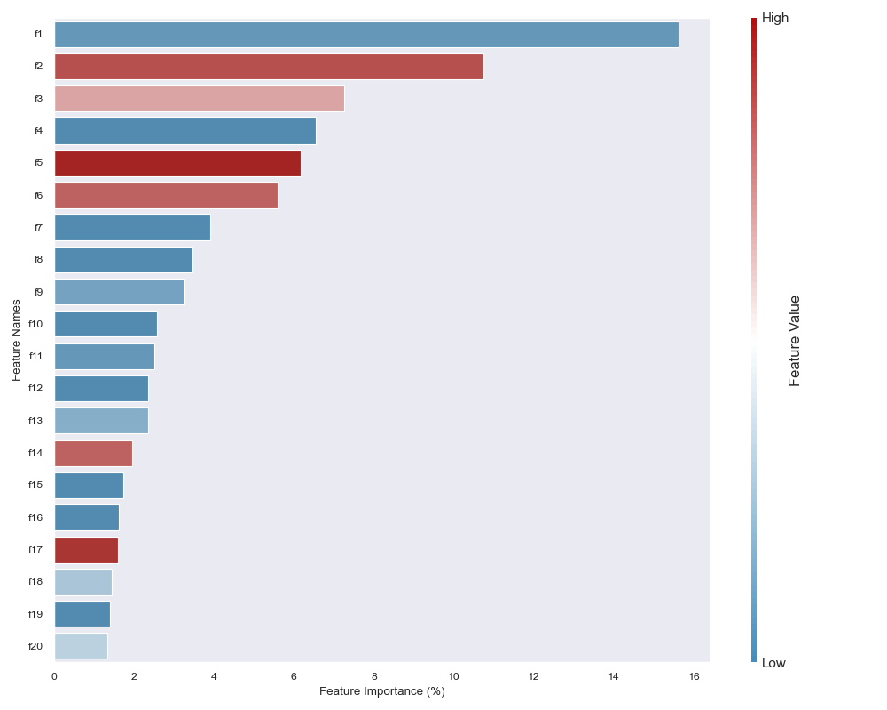

# SHAP Barplot

Modified SHAP summary plot as a bar plot, showing both feature importance as a proportion of overall movement from baseline output and directionality as color. Only applicable to binary classification problems. 

<p align="center">

</p>

In the example above, `f1` is the most important feature (contributing 18% to model output on average), and low values of the feature are correlated with positive classification.

## Usage
```
X = <np.array of (# observations, # features)>
shap_values = <np.array of (# observations, # features)>
column_names = <List of column names>

from shap_barplot import barplot
barplot.shap_barplot(X, shap_values, column_names)
```